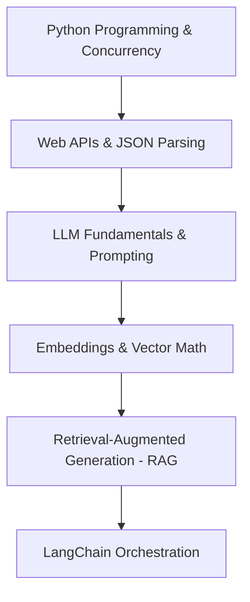

# LangChain: Technology Analysis & Ecosystem Guide (2026 Edition)

This document provides a first-principles guide and technology ecosystem analysis for **LangChain**. It is structured to build a clear, conceptual foundation of LLM orchestration, trace dependencies, evaluate the current landscape, compare alternatives, and establish a pragmatic learning path for AI/GenAI engineering.

---

## 1. Technology Analysis: LangChain

### A. Domain
**LLM Orchestration & Application Architecture.** LangChain operates as the middleware layer of the generative AI stack, sitting between foundational models (LLMs/LMMs), external datastores (vector databases, SQL, search engines), and client-side application interfaces.

### A0. Underlying Concepts
*   **Directed Acyclic Graphs (DAGs):** Workflows are composed as pipelines where data flows unidirectionally from input through transformations to outputs.
*   **Functional Composition:** Linking small, single-purpose functions (e.g., prompt template formatting, model invocation, output parsing) into complex pipelines.
*   **Stateful Pipelines:** Propagating and mutation of state (like chat history) across multiple non-contiguous execution steps.
*   **Serialization and Schemas:** Normalizing polymorphic inputs and outputs across various proprietary and open-source formats (like OpenAI schemas, JSON, and raw text).
*   **Streaming & Concurrency:** Handling token-by-token streaming, async executions, and parallel network calls to reduce latency.

### A1. Prerequisites
*   **Intermediate Python/TypeScript:** Proficiency in asynchronous programming (`asyncio`), decorators, typing, and object-oriented paradigms.
*   **REST APIs & HTTP:** Clear understanding of status codes, payloads, headers, rate-limiting, and backoff strategies.
*   **Foundational LLM Concepts:** Core parameters (temperature, top_p, max_tokens), tokenization limitations, cost metrics, and prompt structure (system, user, assistant messages).

### B. Foundation Technology
LangChain is built on top of native Python/TypeScript concurrency libraries (`asyncio`), data validation engines (**Pydantic** for schema declaration and type safety), standard HTTP clients (`httpx`, `urllib3`), and generic utility libraries like `NumPy` or `PyYAML`. It does not require custom compilers or hardware acceleration.

### C. Historical Problem
Before LangChain, developers wrote highly coupled, fragile boilerplate code to interact with LLMs. Each model provider (OpenAI, Cohere, Anthropic) utilized proprietary SDK structures. Swapping a model or database required rewriting prompt formatters, parsing logic, and retry handlers. Combining multiple calls or adding memory resulted in spaghetti code.

### D. Existence
LLMs are essentially stateless, non-deterministic next-token predictors that operate entirely via text. To build production applications, developers must feed them contextual history, bind them to external tools, validate their outputs, and chain multiple inferences together. LangChain exists to standardize these common patterns into modular, reusable components.

### E. Purpose
To provide a unified, composable interface (via **LangChain Expression Language - LCEL**) that decouples application logic from specific model providers, vector stores, and APIs, enabling engineers to build complex, tool-enabled, and retrieval-augmented LLM pipelines rapidly.

### F. Problem Solved
*   **Wrapper Fatigue:** Eliminates writing custom integrations for dozens of different APIs.
*   **Pipeline Rigidity:** Standardizes pipeline composition so switching a model, database, or parser is as simple as updating a variable in a chain.
*   **Output Instability:** Provides tools to parse unstructured model responses directly into typed schemas (e.g., Pydantic models).
*   **Observability Gap:** Integrates out-of-the-box tracing (via LangSmith) to audit every step, token count, and latency inside complex chains.

### G. Alternatives
*   **LlamaIndex:** Superior for complex document ingestion, semantic search, and data-centric RAG pipelines.
*   **Haystack:** Highly modular, enterprise-focused pipeline framework popular for semantic search and question answering.
*   **Raw Provider SDKs:** Writing clean, native code (e.g., directly using the `google-genai` or `anthropic` client libraries) is the main alternative, offering zero abstraction overhead and complete control.
*   **PydanticAI:** A newer, model-agnostic framework built strictly around Pydantic validation and state management.

### H. Core Components
*   **Prompts:** `PromptTemplates` that standardize parameter injection into prompts.
*   **Models:** Standardized wrapper interfaces for `ChatModels` and raw text completion `LLMs`.
*   **Output Parsers:** Mechanisms to extract structured objects (JSON, CSV, Pydantic objects) from text outputs.
*   **Document Loaders & Text Splitters:** Utilities to parse raw files (PDFs, HTML, Markdown) and chunk them for semantic search.
*   **Vector Stores & Retrievers:** Abstraction layers over vector databases to fetch context documents based on vector embeddings.
*   **Tools & Toolkits:** Interfaces that allow LLMs to invoke external APIs, databases, or local scripts.
*   **Runnables (LCEL):** The unifying protocol that implements standard methods (`invoke`, `stream`, `batch`, `ainvoke`) across all core components.

### I. Architecture Flow
```
                     +---------------------------------------+
                     |             Client / App              |
                     +-------------------+-------------------+
                                         | Input Query
                                         v
                     +-------------------+-------------------+
                     |          PromptTemplate               |
                     +-------------------+-------------------+
                                         | Formatted Prompt
                                         v
+------------------+  +-------------------+-------------------+
|    Vector DB     |->|             Retriever                 |
| (Context Source) |  +-------------------+-------------------+
+------------------+                      | Retrieval Context
                                          v
                     +-------------------+-------------------+
                     |            ChatModel (LLM)            |
                     +-------------------+-------------------+
                                         | Raw Model Output
                                         v
                     +-------------------+-------------------+
                     |            Output Parser              |
                     +-------------------+-------------------+
                                         | Structured JSON / Output
                                         v
                     +-------------------+-------------------+
                     |             Client / App              |
                     +---------------------------------------+
```

### J. Internal Workflow
When a chain like `chain = prompt | model | parser` is executed via `chain.invoke(input)`:
1.  **LCEL Execution:** The `RunnableSequence` coordinates the call, passing output from one step as input to the next.
2.  **Prompt Generation:** The input dictionary is validated and formatted into a list of standardized `BaseMessage` objects.
3.  **Model Invocation:** The formatted messages are serialized to the target model provider's HTTP payload format and sent over the network.
4.  **Network Resolution:** LangChain handles timeouts, retries, and errors according to the configured parameters.
5.  **Parsing:** The raw model payload is intercepted, stripped of metadata, and fed to the `OutputParser` which decodes, validates against the Pydantic/JSON schema, and returns the typed object.
6.  **Callback Propagation:** Throughout the lifecycle, events are dispatched asynchronously to listeners (e.g., LangSmith) for tracing and logging.

### K. Key Terms
*   **LCEL:** LangChain Expression Language, a declarative way to chain LangChain components together using the pipe operator (`|`).
*   **Runnable:** The base protocol implemented by almost all LangChain objects, providing unified sync, async, batch, and streaming interfaces.
*   **Document:** A standard object containing `page_content` (string) and `metadata` (dictionary).
*   **Retriever:** An interface that returns LangChain `Document` objects given a text query, without being bound to a specific vector database.
*   **Tool:** A description of a function (name, description, input schema) that an LLM can choose to invoke, along with the function itself.
*   **Memory:** Persistence abstractions for managing state, chat history, and context window compression.

### L. Advantages
*   **Ecosystem Scale:** Incredibly wide range of integrations with vector databases, models, loaders, and databases.
*   **Rapid Prototyping:** A few lines of LCEL can build a fully functional RAG pipeline or Agent.
*   **Standardized Interfaces:** Easily switch from one LLM (e.g., Gemini) to another (e.g., Claude) without changing downstream logic.
*   **Production Tooling:** Seamless, native integration with **LangSmith** for tracing, debugging, and evaluation.

### M. Disadvantages
*   **Wrapper Fatigue / Complexity:** Too many layers of abstraction make it difficult to debug stack traces and understand what is happening under the hood.
*   **API Instability:** High rate of API changes and deprecations, leading to out-of-date tutorials and breaking updates.
*   **Performance Overhead:** Minor processing latency and memory overhead compared to writing clean, native SDK calls.
*   **Rigidity in Complex Logic:** While simple chains are easy to write, complex branching or state loops quickly become unreadable in pure LCEL (requiring LangGraph).

### N. When To Use
*   Building applications that must run across **multiple model providers** (e.g., hybrid Gemini and Claude architectures).
*   Implementing **Retrieval-Augmented Generation (RAG)** systems that pull from diverse document sources.
*   **Prototyping** greenfield GenAI features quickly to validate product-market fit.
*   Projects requiring deep integration with a wide variety of third-party tools or SaaS APIs.

### O. Real-World Usage
*   **Enterprise Search Engines:** Consolidating internal wikis, Slack histories, and databases into a single queryable agent.
*   **Automated Customer Service:** Dynamic chat portals that query API endpoints to resolve shipping issues or fetch invoice details.
*   **Data Extraction pipelines:** Crawling financial reports, parsing tabular structures, and formatting them into structured database inputs.
*   **Code Assistants:** Synthesizing repository contexts to assist engineers with refactoring tasks.

### P. When Not To Use
*   **Single-Model Applications:** If your app only uses OpenAI or Gemini and will never swap, call the native SDK directly. It reduces dependencies and keeps code maintainable.
*   **High-Throughput, Low-Latency Pipelines:** If milliseconds matter (e.g., real-time voice translation), the overhead of LangChain's layers is detrimental.
*   **Highly Dynamic Agent Architectures:** If your workflows require complex state loops, human-in-the-loop steps, and parallel execution paths, use **LangGraph** or raw python code, not LangChain chains.

### Q. Small Project: "Local Smart PDF Searcher"
A command-line script that accepts a PDF file path and a user query, parses the PDF, stores text chunks in an in-memory vector database, and uses a local model (via Ollama) or an API model to answer questions based on the document.
*   **Load:** `PyPDFLoader` to read the PDF.
*   **Split:** `RecursiveCharacterTextSplitter` with `chunk_size=1000` and `chunk_overlap=200`.
*   **Store:** `Chroma` database initialized with a local embedding model.
*   **Retrieve:** VectorStore retriever with similarity search.
*   **Answer:** An LCEL chain composing prompt, model, and parser.

### R. Scaling Path
1.  **Local Dev:** Local SQLite or Chroma DB + single API keys + linear LCEL chains.
2.  **Production Vector DB:** Swap local storage for a managed, scalable vector store (e.g., Qdrant or Pinecone).
3.  **State Management:** Transition linear chains into graph-based workflows using **LangGraph** for resilient multi-agent logic.
4.  **Telemetry & Tracing:** Connect **LangSmith** to monitor latency, track costs, and evaluate output quality.
5.  **Hosting:** Deploy endpoints using **LangServe** or containerize a custom **FastAPI** application deployed to Kubernetes or serverless cloud instances.

### S. Interview Questions
1.  **Q:** *Explain the concept of a `Runnable` in LangChain. What methods does it expose, and why is it core to the framework?*
    **A:** A Runnable is the base protocol that standardizes how components execute. It exposes sync (`invoke`), async (`ainvoke`), batching (`batch`/`abatch`), and streaming (`stream`/`astream`) interfaces. It ensures that components (prompts, models, parsers) can be composed using the pipe operator (`|`) into chains while propagating arguments, configurations, and callbacks automatically.
2.  **Q:** *Why does LangChain recommend using `ChatPromptTemplate` over standard python f-strings in production?*
    **A:** `ChatPromptTemplate` structures inputs into distinct role objects (`SystemMessage`, `HumanMessage`, `AIMessage`). This preserves formatting compatibility across different LLM backends, prevents prompt injection vulnerabilities, and ensures that tool-calling schemas are cleanly appended to the system instructions.
3.  **Q:** *What is the difference between a `VectorStore` and a `Retriever` in LangChain?*
    **A:** A `VectorStore` is a storage abstraction representing a physical database containing vector embeddings and raw text. A `Retriever` is a logical wrapper that takes a text query and returns a list of matching `Document` objects. While a Retriever can be backed by a VectorStore, it can also wrap a web search API, a SQL database, or a custom ranker without exposing the underlying storage mechanisms.

### T. One-Line Summary
LangChain is a modular middleware framework that standardizes the orchestration of prompts, models, retrievers, and tools to construct structured language-model applications.

---

## 2. Dependency Analysis

To learn LangChain effectively, an engineer must master several underlying layers of the AI stack. 



### Prerequisite Detail

#### 1. Python Programming & Concurrency
*   **Why is it needed?** LangChain relies heavily on asynchronous design patterns, type hinting, decorators, and functional composition.
*   **Minimum Depth:** Must understand async/await syntax, how event loops work, dict comprehension, Pydantic validation schemas, and general class inheritance.
*   **Important Concepts:** `asyncio.gather`, generator functions (`yield` for streaming), class interfaces, and custom exception handling.
*   **Can LangChain be learned without it?** No. Attempting to build or debug production chains without understanding async Python leads to blocked event loops and unmaintainable code.

#### 2. Web APIs & JSON Parsing
*   **Why is it needed?** Models output strings that must be parsed, and agents call third-party APIs that return complex payloads.
*   **Minimum Depth:** Ability to structure REST calls, handle status codes, retry logic, and manipulate nested JSON objects.
*   **Important Concepts:** HTTP methods (POST, GET), JSON Schema validation, bearer token authentication, and rate-limit headers.
*   **Can LangChain be learned without it?** No. Most production applications use tool calling and structured outputs, both of which are thin wrappers around JSON validation.

#### 3. LLM Fundamentals & Prompting
*   **Why is it needed?** LangChain is simply a client orchestrating LLMs. If you do not understand the model's limitations, you cannot design stable chains.
*   **Minimum Depth:** Understanding context windows, attention mechanisms, token costs, difference between system/user roles, and token generation strategies.
*   **Important Concepts:** Context window exhaustion, prompt engineering techniques (Few-shot, Chain-of-Thought), and hyperparameter tuning (temperature, top_p).
*   **Can LangChain be learned without it?** Yes, but you will build highly fragile applications that hallucinate or break frequently.

#### 4. Embeddings & Vector Math
*   **Why is it needed?** Vectors are the bridge between semantic text searches and database retrieval.
*   **Minimum Depth:** Conceptual understanding of how text is mapped to high-dimensional space and compared via cosine similarity.
*   **Important Concepts:** Dimension size, similarity metrics (cosine, inner product, L2), and embedding model limitations.
*   **Can LangChain be learned without it?** Yes, but you will treat vector databases as "magic black boxes," making it impossible to tune retrieval quality.

#### 5. Retrieval-Augmented Generation (RAG)
*   **Why is it needed?** RAG is the most common pattern in generative AI engineering. LangChain's design is heavily optimized for RAG.
*   **Minimum Depth:** Understanding the ingestion pipeline (load -> split -> embed -> index) and retrieval pipeline (query -> embed -> search -> construct prompt).
*   **Important Concepts:** Chunking strategies, metadata filtering, retrieve-then-read, and retrieval precision vs. recall.
*   **Can LangChain be learned without it?** Yes, but your usage of LangChain will be limited to basic chat wrappers.

---

## 3. Technology Ecosystem Analysis

The generative AI landscape is highly fragmented. To build an end-to-end system, LangChain must be integrated with external components. Below is the ecosystem analysis of the 14 major categories.

### 1. LLM Providers
*   **Purpose:** To serve the core intelligence engine (text generation, reasoning, and tool calling).
*   **Why it is used:** Generating text and logic. Custom internal models are expensive to host and train.
*   **Advantages:** Instant scale, state-of-the-art reasoning, no local hardware maintenance.
*   **Disadvantages:** Privacy concerns, network latency, unpredictable API cost structures, rate limits.
*   **Learning Priority:** Critical.
*   **Beginner Friendliness:** High.
*   **Production Popularity:** Dominant.

### 2. Embedding Models
*   **Purpose:** To convert unstructured text into dense vector representations for semantic search.
*   **Why it is used:** Enables computers to perform mathematical operations to find semantically similar text.
*   **Advantages:** Low cost, high speed, crucial for finding context in massive datasets.
*   **Disadvantages:** Model quality dictates search accuracy; switching models requires re-indexing the entire database.
*   **Learning Priority:** High.
*   **Beginner Friendliness:** High.
*   **Production Popularity:** High.

### 3. Vector Databases
*   **Purpose:** To store, index, and query high-dimensional vector embeddings along with document metadata.
*   **Why it is used:** Traditional databases are not optimized for fast nearest-neighbor (ANN) calculations over millions of vectors.
*   **Advantages:** Extremely fast semantic lookups, scalar filtering, scalable horizontal clustering.
*   **Disadvantages:** Indexing overhead, high memory usage, cold-start query latencies on large indices.
*   **Learning Priority:** High.
*   **Beginner Friendliness:** Medium.
*   **Production Popularity:** High.

### 4. Document Loaders
*   **Purpose:** To extract clean text and structural layout from diverse file formats (PDFs, PPTX, HTML, databases).
*   **Why it is used:** Unprocessed raw files contain binary formats, styling elements, and metadata that break LLM context windows.
*   **Advantages:** Ready-made connectors for almost all popular document sources and cloud drives.
*   **Disadvantages:** Poor handling of tables, images, and non-standard layouts inside PDFs.
*   **Learning Priority:** Medium.
*   **Beginner Friendliness:** High.
*   **Production Popularity:** Medium.

### 5. Reranking Models
*   **Purpose:** To evaluate and re-order retrieval matches using cross-encoder architectures.
*   **Why it is used:** Standard vector searches prioritize semantic similarity but miss exact relevance or contextual nuance. Reranking provides highly accurate ordering.
*   **Advantages:** Dramatically improves RAG accuracy by filtering out irrelevant documents before feeding them to the LLM.
*   **Disadvantages:** Introduces extra network call latency and cost per query.
*   **Learning Priority:** Medium.
*   **Beginner Friendliness:** High.
*   **Production Popularity:** Medium-High.

### 6. Agent Frameworks
*   **Purpose:** To design systems where the LLM decides the flow of execution, tool execution, and loops dynamically.
*   **Why it is used:** Traditional code is linear; agents can solve complex, open-ended tasks by iterating and self-correcting.
*   **Advantages:** Capable of solving complex multi-step problems, high autonomy, human-like reasoning loops.
*   **Disadvantages:** Prone to infinite loops, high token consumption, unpredictable execution paths, hard to debug.
*   **Learning Priority:** High.
*   **Beginner Friendliness:** Medium-Low.
*   **Production Popularity:** Growing rapidly.

### 7. Memory Systems
*   **Purpose:** To maintain context, user profile state, and conversation histories across stateless API interactions.
*   **Why it is used:** LLMs have zero recall of past requests. Memory feeds the context of past interactions back into the model.
*   **Advantages:** Keeps conversation natural, enables personalized answers, handles session management.
*   **Disadvantages:** Can swell the context window, increasing latency and cost; requires filtering mechanisms.
*   **Learning Priority:** Medium.
*   **Beginner Friendliness:** High.
*   **Production Popularity:** High.

### 8. Observability & Tracing Tools
*   **Purpose:** To capture log traces, latency, costs, inputs, outputs, and intermediate states of LLM calls.
*   **Why it is used:** LLM chains are complex black boxes. Without execution tracing, debugging logic bugs is impossible.
*   **Advantages:** Instant step-by-step auditing, visual inspection of prompts, cost tracking, diagnostic replays.
*   **Disadvantages:** Introduces slight telemetry network overhead; hosting costs for private storage of logs.
*   **Learning Priority:** Critical.
*   **Beginner Friendliness:** High.
*   **Production Popularity:** Critical.

### 9. Evaluation Frameworks
*   **Purpose:** To mathematically measure the accuracy, faithfulness, hallucinations, and toxicity of LLM outputs.
*   **Why it is used:** Traditional unit tests cannot assert the quality of open-ended conversational text.
*   **Advantages:** Automates regression testing for prompts, checks RAG accuracy using context metrics.
*   **Disadvantages:** Costly (often requires using stronger LLMs like GPT-4o to judge outputs), slow, metrics can have high variance.
*   **Learning Priority:** Medium-High.
*   **Beginner Friendliness:** Medium-Low.
*   **Production Popularity:** Growing.

### 10. Deployment Technologies
*   **Purpose:** To package, serve, scale, and host LangChain application code as reliable production endpoints.
*   **Why it is used:** To convert script prototypes into scalable APIs that handle concurrent requests.
*   **Advantages:** Predictable scaling, isolation of dependencies, ease of CI/CD orchestration.
*   **Disadvantages:** Requires devops knowledge, infrastructure maintenance, container configurations.
*   **Learning Priority:** Medium.
*   **Beginner Friendliness:** Medium-Low.
*   **Production Popularity:** High.

### 11. API Frameworks
*   **Purpose:** To wrap LangChain execution flows inside standard web endpoints (REST, WebSocket, SSE).
*   **Why it is used:** External client frontends (React, iOS) need standard web interfaces to talk to LLM processes.
*   **Advantages:** High speed, native asynchronous handling, auto-generated OpenAPI documentation.
*   **Disadvantages:** Requires building manual routing and serialization logic for custom objects.
*   **Learning Priority:** High.
*   **Beginner Friendliness:** High.
*   **Production Popularity:** High.

### 12. Databases (SQL / NoSQL)
*   **Purpose:** To persist structured user metadata, configuration states, audit logs, and document metadata.
*   **Why it is used:** GenAI systems require standard relational state management alongside semantic vector indices.
*   **Advantages:** Atomic transactions, schema validation, robust querying of structured business logic.
*   **Disadvantages:** Rigid schemas, requires mapping relational tables to stateless LLM contexts.
*   **Learning Priority:** High.
*   **Beginner Friendliness:** High.
*   **Production Popularity:** Ubiquitous.

### 13. Cloud Platforms
*   **Purpose:** To provide the underlying compute, storage, security, and orchestration layers for running applications.
*   **Why it is used:** Scalable hosting, compliance with security regulations, and managed services (IAM, VPC).
*   **Advantages:** Enterprise-grade security, global availability, managed database services.
*   **Disadvantages:** Complex configurations, cost management risks, vendor lock-in potential.
*   **Learning Priority:** Medium.
*   **Beginner Friendliness:** Low.
*   **Production Popularity:** Ubiquitous.

### 14. Workflow Orchestration Tools
*   **Purpose:** To manage bulk data ingestion pipelines, scheduling, and batch jobs (e.g. daily vector syncing).
*   **Why it is used:** To scale ETL pipelines that clean and embed millions of documents asynchronously.
*   **Advantages:** Automatic retries, rate-limit management over slow APIs, DAG tracking, scheduling.
*   **Disadvantages:** Operational overhead, complex configurations, excessive for real-time systems.
*   **Learning Priority:** Medium-Low.
*   **Beginner Friendliness:** Low.
*   **Production Popularity:** High.

---

## 4. Ranking Tables

The following tables rank the technologies within key categories based on their design properties and production viability.

### LLM Providers
| Rank | Technology | Purpose | Advantages | Disadvantages | Beginner Score (1-10) | Production Score (1-10) | Learning Priority |
| :--- | :--- | :--- | :--- | :--- | :---: | :---: | :--- |
| **1** | Anthropic (Claude) | Reasoning, Complex Coding | Industry-leading system instructions, massive context, precise formatting. | Higher pricing, lower rate-limits initially. | 9 | 10 | High |
| **2** | OpenAI (GPT-4o) | General Intelligence, Tool Calling | High rate limits, fastest structured JSON, broad industry integration. | Token latency variance, shifting API versions. | 10 | 9.5 | High |
| **3** | Gemini (Google) | Multimodal, Long Context | 2 Million token context, cheapest rate-per-token, great multimodal capability. | API library inconsistencies. | 9 | 9 | High |
| **4** | Open Source (Llama-3 via vLLM) | Privacy, Custom fine-tuning | Full data control, customizable inference setups, cheap at scale. | Demands GPU clusters, complex maintenance. | 6 | 8 | Medium |
| **5** | Groq | Ultra-low latency inference | Unmatched response speed (tokens/sec), great for real-time loops. | Small selection of models, strict context limits. | 9 | 7 | Low |

### Vector Databases
| Rank | Technology | Purpose | Advantages | Disadvantages | Beginner Score (1-10) | Production Score (1-10) | Learning Priority |
| :--- | :--- | :--- | :--- | :--- | :---: | :---: | :--- |
| **1** | Qdrant | Dense/Sparse Hybrid Retrieval | Built in Rust, ultra-fast search, native sparse vector support, rich metadata filtering. | Relies heavily on memory config. | 8 | 9.5 | High |
| **2** | Pinecone | Managed Cloud Vector Database | Zero-ops setup, high scalability, serverless pay-per-query model. | Vendor lock-in, no offline/local execution. | 10 | 9 | High |
| **3** | Weaviate | Object-Vector Relation DB | Hybrid search, modular ecosystem, GraphQL API. | Complex initial learning curve. | 7 | 8.5 | Medium |
| **4** | Milvus | Large-scale Enterprise Store | Built for billions of vectors, highly distributed architecture. | Heavy resource footprint, hard to self-host. | 5 | 8 | Medium |
| **5** | Chroma | Local Prototyping Vector DB | Instant setup inside python scripts, zero configurations. | Poor scaling, single-process, locks database. | 10 | 2 | Low |

### Agent Frameworks
| Rank | Technology | Purpose | Advantages | Disadvantages | Beginner Score (1-10) | Production Score (1-10) | Learning Priority |
| :--- | :--- | :--- | :--- | :--- | :---: | :---: | :--- |
| **1** | LangGraph | Stateful, Looping Workflows | Strict state control, native cyclic execution, multi-agent support. | Steep learning curve, verbose boilerplate. | 6 | 9.5 | High |
| **2** | PydanticAI | Type-Safe Agent Logic | Elegant validation, built by the Pydantic team, light execution layer. | Smaller community footprint currently. | 9 | 8.5 | High |
| **3** | CrewAI | Role-Based Hierarchical Groups | High level abstraction, quick multi-agent setup, handles tasks easily. | Hard to debug, high token consumption. | 9 | 6.5 | Medium |
| **4** | LangChain | Linear Chains & Basic Agents | Simple setup, extensive standard tool integrations. | Fails on cyclic logic or complex state. | 10 | 6 | Medium |
| **5** | AutoGen | Dynamic Conversational Agents | Extremely flexible interactions, conversational structures. | Very unpredictable, difficult output validation. | 5 | 5.5 | Low |

### API Frameworks
| Rank | Technology | Purpose | Advantages | Disadvantages | Beginner Score (1-10) | Production Score (1-10) | Learning Priority |
| :--- | :--- | :--- | :--- | :--- | :---: | :---: | :--- |
| **1** | FastAPI | High-Perf Asynchronous API | Native Python async, automatic OpenAPI generation, fast validation via Pydantic. | Requires manual router structuring. | 9 | 10 | High |
| **2** | Django | Enterprise Full-Stack Service | Built-in authentication, robust ORM, admin panel out of the box. | Synchronous design roots, heavy footprint. | 6 | 8 | Medium |
| **3** | Flask | Microframework | Simplicity, zero overhead, highly customizable structure. | No native async, manual schema setups. | 9 | 7 | Low |

### Deployment
| Rank | Technology | Purpose | Advantages | Disadvantages | Beginner Score (1-10) | Production Score (1-10) | Learning Priority |
| :--- | :--- | :--- | :--- | :--- | :---: | :---: | :--- |
| **1** | Docker | Container Isolation | Build once, run anywhere; pins exact dependencies and OS. | Requires understanding filesystem permissions. | 8 | 10 | High |
| **2** | Serverless (AWS Lambda / GCP Run) | Scaling Compute on Demand | Scales down to zero, zero server management. | Cold-start delays, strict timeout constraints. | 7 | 8.5 | High |
| **3** | Kubernetes | Large-Scale Orchestration | Advanced autoscaling, rolling updates, stateful cluster controls. | Massive learning curve, configuration sprawl. | 3 | 9.5 | Medium |

---

## 5. Alternatives Comparison

When architecting a production system, selecting the correct orchestration library is critical. Here is how LangChain compares to the most prominent alternatives.

### Alternative Framework Analysis

#### 1. LangGraph
*   **Purpose:** Stateful, multi-agent orchestration featuring cyclic graph execution.
*   **Strengths:** First-class support for loops, branching logic, human-in-the-loop steps, and strict state schemas.
*   **Weaknesses:** Verbose code, requires a mental shift to graph theory, higher setup boilerplate.
*   **Best Use Cases:** Complex agents, customer support workflows, iterative code generation.
*   **Learning Difficulty:** Medium-High.
*   **Industry Adoption:** Extremely High in Enterprise.

#### 2. LlamaIndex
*   **Purpose:** Data-centric ingestion and retrieval framework optimizing search and context structure.
*   **Strengths:** Best-in-class document chunking, indexing models, structured data querying (SQL+Vector), and hybrid retrieval.
*   **Weaknesses:** Less flexible for general-purpose tool use, wrapper heavy for agent-only workflows.
*   **Best Use Cases:** Complex RAG systems, document intelligence tools, semantic file-search.
*   **Learning Difficulty:** Medium.
*   **Industry Adoption:** Very High.

#### 3. Haystack
*   **Purpose:** Modular pipeline orchestration for search, retrieval, and information extraction.
*   **Strengths:** Visual-friendly DAG structures, strict typing, high performance, robust enterprise architecture.
*   **Weaknesses:** Smaller ecosystem of integrations compared to LangChain.
*   **Best Use Cases:** Production semantic search systems, hybrid question-answering portals.
*   **Learning Difficulty:** Medium.
*   **Industry Adoption:** High (especially in European enterprises).

#### 4. CrewAI
*   **Purpose:** High-level framework for task-oriented, role-based multi-agent teams.
*   **Strengths:** Extremely rapid setup of complex agent roles, intuitive declarative API.
*   **Weaknesses:** Inflexible when executing strict logic, highly prone to infinite agent-to-agent talk loops, high token consumption.
*   **Best Use Cases:** Marketing generation, simple business research, content creation pipelines.
*   **Learning Difficulty:** Low.
*   **Industry Adoption:** Moderate.

#### 5. AutoGen
*   **Purpose:** Multi-agent conversation framework allowing complex agent interactions.
*   **Strengths:** Highly dynamic agent communication topologies, good default patterns for code execution.
*   **Weaknesses:** Highly non-deterministic, difficult to enforce JSON state structures, hard to run reliably in production.
*   **Best Use Cases:** Open-ended simulations, autonomous game testing, software development simulations.
*   **Learning Difficulty:** High.
*   **Industry Adoption:** Moderate.

#### 6. PydanticAI
*   **Purpose:** Lightweight, model-agnostic agent framework built strictly around Pydantic validation.
*   **Strengths:** Native support for type validation, clean pythonic design, lightweight footprint, easy unit testing.
*   **Weaknesses:** Newer framework, fewer third-party service wrappers.
*   **Best Use Cases:** Production-grade agent backends requiring strict type safety and simple architectures.
*   **Learning Difficulty:** Low-Medium.
*   **Industry Adoption:** Rapidly Growing.

### Summary Comparison Table
| Technology | Core Focus | Programming Paradigm | Looping / Cycles | Data Ingestion | Production Readiness |
| :--- | :--- | :--- | :---: | :---: | :---: |
| **LangChain** | Linear chaining & integrations | Declarative (LCEL) | Poor | Medium | High |
| **LangGraph** | Stateful multi-agent loops | Graph-based (Nodes/Edges) | Excellent | Low | High |
| **LlamaIndex** | Data retrieval & indexing | Object-oriented | Poor | Excellent | High |
| **Haystack** | Search Pipelines | Explicit DAG pipelines | Medium | High | High |
| **CrewAI** | Role-based agent teams | Declarative configuration | Medium | Low | Medium |
| **AutoGen** | Conversational agent simulation | Event-driven callbacks | High | Low | Low |
| **PydanticAI** | Type-safe structured agents | Pythonic / Decorators | Medium | Low | High |

---

## 6. Learning Roadmap

This structured path takes an engineer from raw programming foundations to designing production-grade agentic architectures.

```mermaid
gantt
    title Learning Roadmap Timeline
    dateFormat  YYYY-MM-DD
    section Foundations
    Phase 1: Python, APIs & Concurrency :active, p1, 2026-06-01, 14d
    Phase 2: LLM & Prompt Engineering Fundamentals : p2, after p1, 14d
    section Implementation
    Phase 3: Retrieval-Augmented Generation (RAG) : p3, after p2, 21d
    Phase 4: Mastering LangChain Core & LCEL : p4, after p3, 21d
    section Advanced Orchestration
    Phase 5: Agent Systems : p5, after p4, 14d
    Phase 6: LangGraph & Advanced State Management : p6, after p5, 21d
    Phase 7: Production AI Systems (Ops, Eval, Scale) : p7, after p6, 28d
```

### Phase 1: Foundations
*   **Topics:** Python async/await model, event loops, generator yielding, typing, Pydantic v2 schemas, REST APIs, JSON parsing.
*   **Skills:** Building fast async request managers with retries, writing structured data validations, catching nested exceptions.
*   **Projects:** An async script that fetches data from 5 public APIs concurrently, validates response shapes using Pydantic, and dumps them into a local DB.
*   **Completion Criteria:** Ability to describe the difference between sync and async execution; writing clean Pydantic classes with nested custom validation decorators.

### Phase 2: LLM Fundamentals
*   **Topics:** Tokenizer operation, context limits, temperature/top_p mechanics, role types (system, human, assistant), structuring API requests.
*   **Skills:** Writing custom instructions, designing few-shot examples, managing token consumption budgets, parsing tool call request payloads.
*   **Projects:** A raw API wrapper (using OpenAI or Gemini native SDK) that parses a block of raw transaction logs and outputs a structured JSON ledger.
*   **Completion Criteria:** Extracting zero-shot and few-shot JSON structures reliably without utilizing wrapper framework parser utilities.

### Phase 3: Retrieval Systems
*   **Topics:** Chunking techniques (character, recursive, semantic), vector math, embedding models, vector indices, hybrid retrieval, reranking.
*   **Skills:** Pre-processing raw texts, optimizing split chunk sizes, querying local vector databases, performing keyword + semantic hybrid search.
*   **Projects:** A local document search engine using a local vector store (Qdrant/Pinecone) that processes multi-page text documents and handles manual queries.
*   **Completion Criteria:** Generating a pipeline that takes a long raw text document, chunks it recursively, generates embeddings, stores them, and retrieves relevant snippets based on query distance scores.

### Phase 4: LangChain Core & LCEL
*   **Topics:** `Runnable` protocol, LCEL orchestration, `ChatPromptTemplate`, `ChatModels`, standard `OutputParsers`, `Retrievers`.
*   **Skills:** Writing structured LCEL chains, streaming outputs chunk-by-chunk, handling runtime model switching, implementing custom runnables.
*   **Projects:** An API service that serves structured extraction, summary, and Q&A over multiple user-uploaded documents, featuring streaming responses.
*   **Completion Criteria:** Building a chain containing conditional routing logic (`RunnableBranch` or custom routing functions) that processes, streams, and parses unstructured user questions.

### Phase 5: Agent Systems
*   **Topics:** ReAct framework, tool binding, dynamic routing, planning models, task breakdown, human-in-the-loop checkpoints.
*   **Skills:** Converting standard Python functions into clean LLM-consumable tools, designing task plans, tracking tool execution failures.
*   **Projects:** A database analyst agent that takes a natural language prompt, generates and executes SQL queries on a local SQLite instance, and interprets results.
*   **Completion Criteria:** Implementing an agent loop that runs recursively until it identifies the final answer, successfully recovering from erroneous SQL commands.

### Phase 6: LangGraph & Advanced State Management
*   **Topics:** StateGraphs, nodes, edges, conditional routing, state reduction, memory checkpoints, human-in-the-loop validation, time-travel debugging.
*   **Skills:** Drafting graph states, designing multi-agent communication networks, persisting execution states across user API sessions.
*   **Projects:** A stateful Customer Support Agent that routes requests based on state, executes refunds, escalates to a human operator, and permits resuming history.
*   **Completion Criteria:** Building a loop-capable agent that pauses for manual human confirmation before triggering high-risk API mutations (e.g., executing a simulated financial payment).

### Phase 7: Production AI Systems
*   **Topics:** Tracing (LangSmith), semantic evaluation (RAGAS / G-Eval), token rate limits, unit testing LLM prompts, Docker container hosting.
*   **Skills:** Profiling chain performance, tracking cost anomalies, evaluating retrieval precision, containerizing pipelines, configuring API security.
*   **Projects:** A production-ready, containerized Q&A service deployed to a staging environment, connected to cloud databases, utilizing real-time evaluation.
*   **Completion Criteria:** Demonstrating a test suite that automatically evaluates system updates against 50 baseline questions, returning quantitative metrics on faithfulness and context recall.

---

## 7. 80/20 Analysis

To accelerate learning, focus heavily on the small subset of concepts and tools that deliver the vast majority of practical capabilities.

### The 20% Concepts (80% of LangChain Understanding)
1.  **The `Runnable` Protocol:** Understanding that everything (prompts, models, retrievers, parsers) implements `invoke()`, `stream()`, and `batch()`. This makes the "magic" pipe syntax (`|`) clear.
2.  **Structured Tool Calling:** Master how LLMs convert text intents into structured JSON arguments designed to hit external API targets.
3.  **State Management:** Learning how LangChain (and LangGraph) passes, updates, and preserves context dictionaries between steps.
4.  **Prompt Structure Roles:** Understanding how to separate instructions (`SystemMessage`) from variables (`HumanMessage`) and outputs (`AIMessage`).

### The 20% Tools (80% of Production Value)
1.  **`ChatPromptTemplate`:** The fundamental way to safely construct inputs.
2.  **`ChatOpenAI` / `ChatAnthropic` / `ChatGemini`:** Decoupled interfaces to call core reasoning models.
3.  **`PydanticOutputParser` (Structured Outputs):** Crucial tool to enforce strict type shapes out of model responses.
4.  **`LangSmith` (Tracing Client):** The single most important developer tool for debugging, performance profiling, and production monitoring.
5.  **`RecursiveCharacterTextSplitter`:** The standard choice for splitting real-world document contents.

### Master First Checklist
*   [ ] Write a script that invokes a model using `ChatPromptTemplate` and `ChatModel`.
*   [ ] Connect a schema definition (Pydantic model) and parse model outputs.
*   [ ] Transform a standard Python helper function into a structured LLM tool using the `@tool` decorator.
*   [ ] Pipe a retrieval search step directly into an LLM context generation template using LCEL syntax.
*   [ ] Connect a local pipeline to **LangSmith** and visually trace the step execution parameters.

---

## 8. Final Learning Guidance

### Concept Map
```
                    +------------------------------------+
                    |        Runnable Protocol           |
                    | (invoke, stream, batch, callbacks) |
                    +-----------------+------------------+
                                      |
         +----------------------------+----------------------------+
         |                            |                            |
         v                            v                            v
+--------+--------+          +--------+--------+          +--------+--------+
|  PromptTemplate |          |   ChatModel     |          |  OutputParser   |
| (Input Format)  |          | (LLM Reasoning) |          | (JSON / Types)  |
+--------+--------+          +--------+--------+          +--------+--------+
         |                            |                            |
         +----------------------------+----------------------------+
                                      | Composed via LCEL (`|`)
                                      v
                    +------------------------------------+
                    |          RunnableSequence          |
                    |             (Chain)                |
                    +------------------------------------+
```

### Dependency Tree

*   **Step 1:** Python Mastery (Asynchronous control, Type annotations, Pydantic modeling)
*   **Step 2:** HTTP Protocols & APIs (REST architectures, JSON formatting)
*   **Step 3:** Foundational LLM Prompting (Roles, system formatting, temperature tuning)
*   **Step 4:** Vector Search Foundations (Distance calculations, embeddings, hybrid retrieval)
*   **Step 5:** RAG Concepts (Parsing, chunking, retrieving, generation context)
*   **Step 6:** LangChain Orchestration (LCEL, ChatModels, Retrievers, Parsers)
*   **Step 7:** Stateful Systems (LangGraph state management, memory databases, persistent session graphs)

### Technology Stack Diagram
```
+-----------------------------------------------------------------------------+
|                                  Frontend                                   |
|                        (React / Next.js Web App)                            |
+-------------------------------------+---------------------------------------+
                                      | HTTP REST / WebSocket Streaming
                                      v
+-----------------------------------------------------------------------------+
|                           FastAPI Gateway Service                           |
|                       (API Routing, Auth, Rate Limits)                      |
+-------------------------------------+---------------------------------------+
                                      |
                                      v
+-----------------------------------------------------------------------------+
|                   Orchestration Layer: LangGraph & LangChain                 |
|   - ChatPromptTemplates (Prompt formatting)                                 |
|   - LangGraph Agent Nodes (State management & execution logic)               |
|   - Tools Layer (Database connections, custom business logic wrappers)       |
+-----------+-------------------------+---------------------------+-----------+
            |                         |                           |
            v Vector Search           v API Calls                 v Telemetry
+-----------+-----------+ +-----------+-----------+ +-------------+-----------+
|    Vector Database    | |   LLM API Provider    | |   Observability Engine  |
|    (e.g., Qdrant)     | | (e.g., Anthropic/Gem)  | |       (LangSmith)       |
+-----------------------+ +-----------------------+ +-------------------------+
```

### Common Beginner Mistakes
1.  **Using `LLM` instead of `ChatModel`:** Beginners often import `from langchain_community.llms import OpenAI` instead of `from langchain_openai import ChatOpenAI`. The base `LLM` class is deprecated or obsolete for most conversational workflows; always use `ChatModel`.
2.  **Over-complicating Simple Tasks with Chains:** Do not force a single-step model call into a multi-layer LCEL chain. If all you need is a simple translation, call the model directly.
3.  **Ignoring Token Limits in Memory:** Appending entire raw chat histories into conversational memory will rapidly exhaust the context window and blow up api costs. Use size-limited windowing or semantic summarizers.
4.  **Relying on Chroma for Production Databases:** Chroma is excellent for testing scripts but fails when scaled. Do not use Chroma in production environments; use Qdrant, Pinecone, or pgvector.
5.  **Debugging Without Tracing:** Trying to debug intermediate prompt states or parser failures using simple print statements is highly inefficient. Always develop with LangSmith tracing enabled.

### Readiness Checklist
*   [ ] Can you build a fully typed Pydantic output model without looking up syntax?
*   [ ] Do you understand why standard character length splitters split sentences mid-word, and why `RecursiveCharacterTextSplitter` is preferred?
*   [ ] Can you explain the difference between a sparse vector (keyword matching) and a dense vector (semantic matching)?
*   [ ] Can you draft a cyclic workflow graph showing how an agent loops when tool calls fail?
*   [ ] Do you know how to configure a callback handler to capture streaming token events inside an active API route?

### Next Technologies To Learn After LangChain
1.  **LangGraph:** To build flexible, stateful, cyclic agent architectures.
2.  **vLLM / Ollama:** To learn how to serve open-source model pipelines locally or in private VPC structures.
3.  **LlamaIndex:** To master complex semantic data ingestion architectures.
4.  **DSPy:** An advanced framework designed to programmatically optimize prompt weights and few-shot examples automatically.

### Industry-Standard LangChain Tech Stack (2026)
*   **Orchestration Engine:** LangGraph (Stateful workflow routing)
*   **Data Validation:** Pydantic v2 (Strict type checking)
*   **Host API Framework:** FastAPI (Asynchronous web requests)
*   **Foundational Intelligence:** Claude 3.5 Sonnet / Gemini 1.5 Pro
*   **Embedding Model:** `text-embedding-3-large` (OpenAI) or `bge-large-en-v1.5`
*   **Vector Engine:** Qdrant (Hybrid search setup)
*   **Telemetry & Tracing:** LangSmith (Quality validation and logging)
*   **CI/CD Containerization:** Docker on AWS ECS / Google Cloud Run
